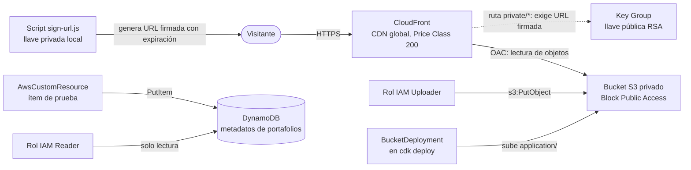

# Arquitectura — Plataforma de Portafolios Estudiantiles

Plataforma estática para que estudiantes de la Universidad del Valle publiquen sus portafolios (HTML, CSS, imágenes, PDFs), con distribución global, almacenamiento privado y soporte para archivos accesibles solo mediante enlaces firmados. Toda la infraestructura está definida con **AWS CDK (TypeScript)** en un único stack.

---

## 1. Diagrama de arquitectura



Acceso directo al bucket: **403**. Acceso a través de CloudFront: **200**.

---

## 2. Componentes

| Componente     | Servicio AWS | Responsabilidad                                                                                           | Decisiones de diseño                                                                                                                                                                                                                                                                              |
| -------------- | ------------ | --------------------------------------------------------------------------------------------------------- | ------------------------------------------------------------------------------------------------------------------------------------------------------------------------------------------------------------------------------------------------------------------------------------------------- |
| Almacenamiento | S3           | Guarda los archivos estáticos del portafolio (HTML, CSS, imágenes, PDFs), tanto públicos como privados.   | **Privado:** `BLOCK_ALL` bloquea todo acceso público. Cifrado gestionado por S3 (`S3_MANAGED`) y `enforceSSL` para aceptar solo HTTPS. `removalPolicy: DESTROY` y `autoDeleteObjects: true` para que `cdk destroy` limpie todo (apropiado para un reto; en producción se conservarían los datos). |
| CDN            | CloudFront   | Sirve el contenido con baja latencia desde edge locations y con caché.                                    | Accede al bucket con **OAC (Origin Access Control)**, que CDK configura junto con la bucket policy. Redirige HTTP a HTTPS y usa `index.html` como objeto raíz. **Price Class 200.**                                                                                                               |
| Metadatos      | DynamoDB     | Registra los metadatos de cada portafolio: estudiante, programa, fecha de publicación, URL y visibilidad. | **Clave de partición:** `studentId` (String), única por estudiante. **Billing mode:** `PAY_PER_REQUEST`: se paga solo por uso, sin reservar capacidad, ideal para una plataforma económica. Incluye un ítem de prueba cargado desde el propio stack.                                              |
| Permisos       | IAM          | Define quién puede escribir en S3 y quién puede leer en DynamoDB.                                         | Dos roles definidos en el stack (no creados manualmente), cada uno con permisos mínimos generados por los métodos `grant*` de CDK. Ver sección 3.                                                                                                                                                 |

Componentes auxiliares que CDK crea automáticamente:

- **Lambda de `BucketDeployment`:** copia la carpeta `application/` al bucket durante el deploy e invalida la caché de CloudFront.
- **Lambda de `autoDeleteObjects`:** vacía el bucket antes de eliminarlo.
- **Lambda de `AwsCustomResource`:** inserta el ítem de prueba en DynamoDB, con permiso limitado a esa tabla.

---

## 3. Seguridad y acceso

**¿Cómo se garantiza que el bucket no sea accesible directamente (403)?**
El bucket tiene `BlockPublicAccess.BLOCK_ALL`, por lo que ninguna URL pública puede leer sus objetos. La única política que permite lectura es la que CDK agrega para el servicio de CloudFront. Una petición directa a `https://<bucket>.s3.amazonaws.com/index.html` devuelve `403 Forbidden`.

**¿Cómo accede CloudFront al bucket privado?**
Mediante **OAC (Origin Access Control)**, el mecanismo actual que reemplaza al antiguo OAI. Se configura con `S3BucketOrigin.withOriginAccessControl(bucket)`, que crea el OAC y agrega automáticamente una bucket policy que permite `s3:GetObject` únicamente a **esta distribución** de CloudFront.

**¿Qué permisos mínimos se otorgaron en IAM?**

| Rol                     | Permiso                                | Cómo se define                                                                | Qué NO puede hacer                                 |
| ----------------------- | -------------------------------------- | ----------------------------------------------------------------------------- | -------------------------------------------------- |
| `PortfolioUploaderRole` | Subir objetos al bucket del portafolio | `bucket.grantPut(role)` (`s3:PutObject`, solo sobre este bucket)              | Leer la tabla, borrar objetos, tocar otros buckets |
| `MetadataReaderRole`    | Leer metadatos de DynamoDB             | `table.grantReadData(role)` (acciones de solo lectura, solo sobre esta tabla) | Escribir o borrar en la tabla, acceder a S3        |

Se eligió `grantPut` en lugar de `grantWrite` porque este último también permite borrar objetos, y quien solo sube portafolios no lo necesita. Los roles usan `AccountRootPrincipal` como principal por simplicidad del reto; en un sistema real se restringiría a una identidad concreta (por ejemplo, una función Lambda o un grupo de usuarios).

**Otras medidas:**

- Cifrado en reposo en S3 y `enforceSSL` en el bucket.
- La llave privada de firma **no** se sube al repositorio (`.gitignore`); en producción se guardaría en AWS Secrets Manager.
- El ítem de prueba se inserta con una política limitada al ARN de la tabla.

---

## 4. Flujo de despliegue

- Lenguaje elegido para CDK: `TypeScript`
- Requisitos: Node.js 18+, AWS CLI configurado (`aws configure`), CDK CLI (`npm install -g aws-cdk`).
- Preparación (una sola vez por cuenta y región): `cdk bootstrap`
- Comandos, ejecutados desde la carpeta `cdk/`:

```bash
cdk synth      # valida el código y genera la plantilla de CloudFormation
cdk deploy     # despliega todo el stack con un solo comando
cdk destroy    # elimina todos los recursos del stack
```

El stack se despliega con un solo `cdk deploy`: crea el bucket, la distribución, la tabla y los roles, sube el contenido de `application/` y carga el ítem de prueba. Al terminar imprime como outputs el nombre del bucket, el nombre de la tabla, la URL de CloudFront, los ARN de los roles y el ID de la llave pública.

**Verificación:**

```bash
curl -I https://<dominio>.cloudfront.net/index.html      # 200
curl -I https://<bucket>.s3.amazonaws.com/index.html     # 403
aws dynamodb scan --table-name <nombre-de-la-tabla>      # ítem de prueba
```

**Llaves de firma (Boss Fight):**

La llave pública de firma (`cdk/keys/public_key.pem`) se incluye en el repositorio, ya que el stack la necesita para sintetizar y desplegar. La llave privada (`cdk/keys/private_key.pem`) **no** se sube (está en `.gitignore`): quien quiera firmar URLs debe generar su propio par de llaves y volver a desplegar.

```bash
cd cdk
mkdir -p keys
openssl genrsa -out keys/private_key.pem 2048
openssl rsa -pubout -in keys/private_key.pem -out keys/public_key.pem
```

Tras el deploy, el ID de la llave pública se obtiene del output `PublicKeyId`, y con él se firma una URL:

```bash
CLOUDFRONT_DOMAIN=<dominio-de-CloudFrontURL> KEY_PAIR_ID=<PublicKeyId> node scripts/sign-url.js private/bruno/index.html 15
```

El dominio se toma del output `CloudFrontURL` (sin `https://`), el ID de llave del output `PublicKeyId`, y el último argumento son los minutos de validez de la URL firmada.

---

## 5. Boss Fight

**¿Cómo se manejaron los archivos privados (signed URLs)?**
Se usan **CloudFront Signed URLs**. Los archivos privados viven bajo el prefijo `private/`, y la distribución tiene una regla adicional (`additionalBehaviors`) para `private/*` con `trustedKeyGroups`, lo que exige una firma válida:

1. Se genera un par de llaves RSA. La **llave pública** se registra en CloudFront (`PublicKey`) y se agrupa en un `KeyGroup`. La **llave privada** queda solo en el equipo de quien firma.
2. El script `cdk/scripts/sign-url.js` firma una URL con la llave privada y le agrega una fecha de expiración.
3. Sin firma, `private/*` responde `403`. Con una firma válida y vigente, entrega el archivo. Al expirar, vuelve a `403`.

Se prefirieron las URLs firmadas de CloudFront frente a las presigned URLs de S3 porque pasan por el CDN, mantienen el bucket cerrado al acceso directo y permiten controlar el acceso por ruta.

Limitación conocida: una URL firmada protege un único archivo. Un HTML privado que enlace a un CSS separado en `private/` haría una petición nueva sin firma. Para la prueba, los estilos van dentro del propio HTML. Para sitios privados completos se podrían usar **cookies firmadas**, que cubren varios archivos.

**¿Qué Price Class se configuró y por qué?**
`PRICE_CLASS_200`, que incluye Norteamérica, Europa, Asia, Medio Oriente y África. Cubre los tres bloques que pide el cliente (América, Europa y Asia) a un costo menor que la clase "All". Observación: Sudamérica solo está incluida en `PRICE_CLASS_ALL`, por lo que los usuarios de América Latina se atienden desde la edge location incluida más cercana. Si el rendimiento en la región fuera crítico, se podría evaluar cambiar a "All".

**¿Cómo conviven archivos públicos y privados en el diseño?**
Con dos comportamientos (behaviors) sobre la misma distribución y el mismo origen:

| Ruta               | Comportamiento                    | Acceso                       |
| ------------------ | --------------------------------- | ---------------------------- |
| `/*` (por defecto) | Sin restricción de firma          | Público                      |
| `private/*`        | `trustedKeyGroups` + `HTTPS_ONLY` | Solo con URL firmada vigente |

El comportamiento público no se modificó, por lo que lo existente no se rompió. Ambos usan el mismo bucket y el mismo OAC, así que el bucket sigue siendo completamente privado.

---

## 6. Limpieza

Tras las pruebas se ejecuta `cdk destroy`. Gracias a `removalPolicy: DESTROY` y `autoDeleteObjects: true`, el bucket se vacía y se elimina junto con el resto del stack. Permanece únicamente el stack `CDKToolkit` del bootstrap, que tiene un costo prácticamente nulo y es reutilizable.
